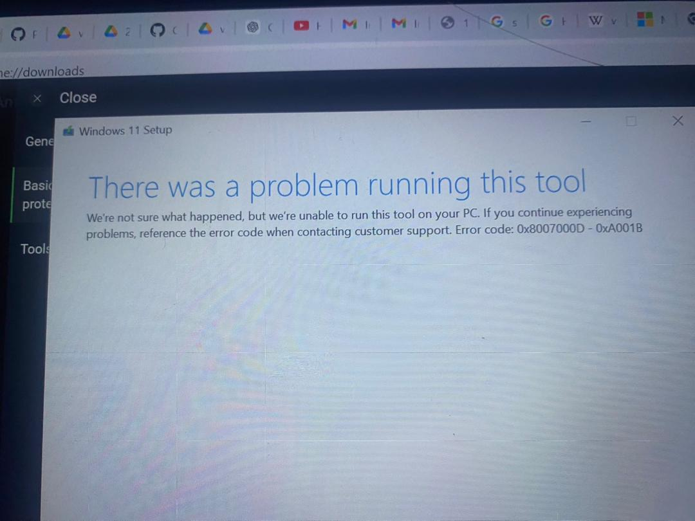
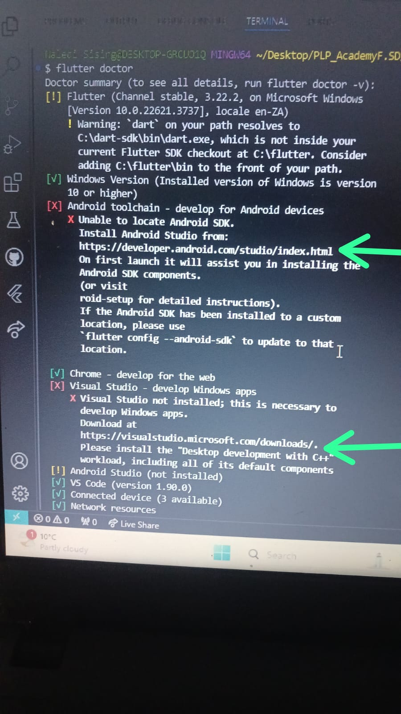
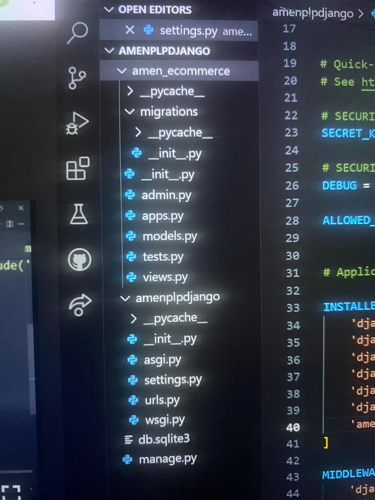
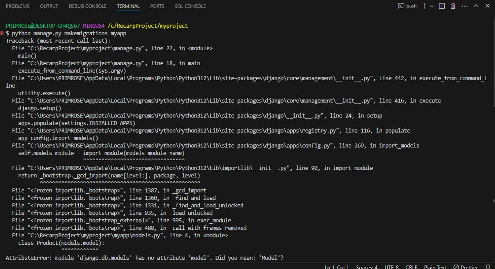
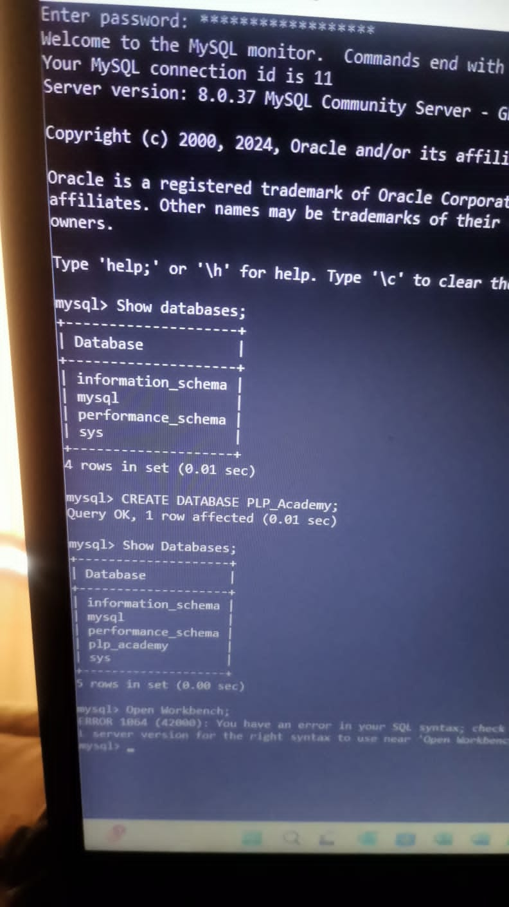
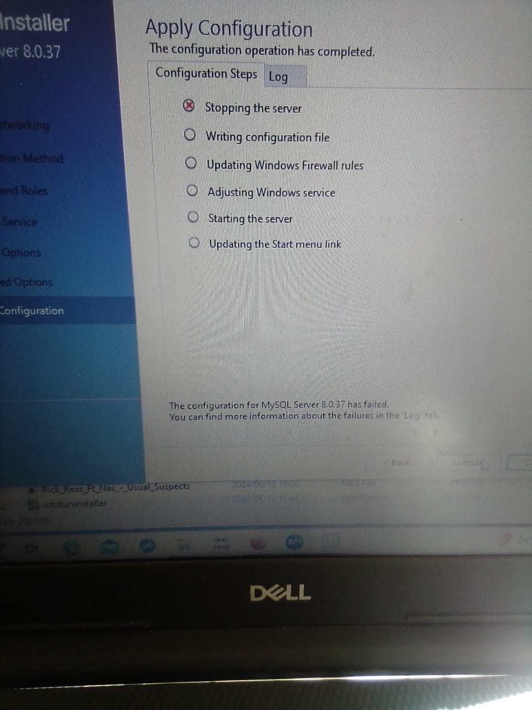
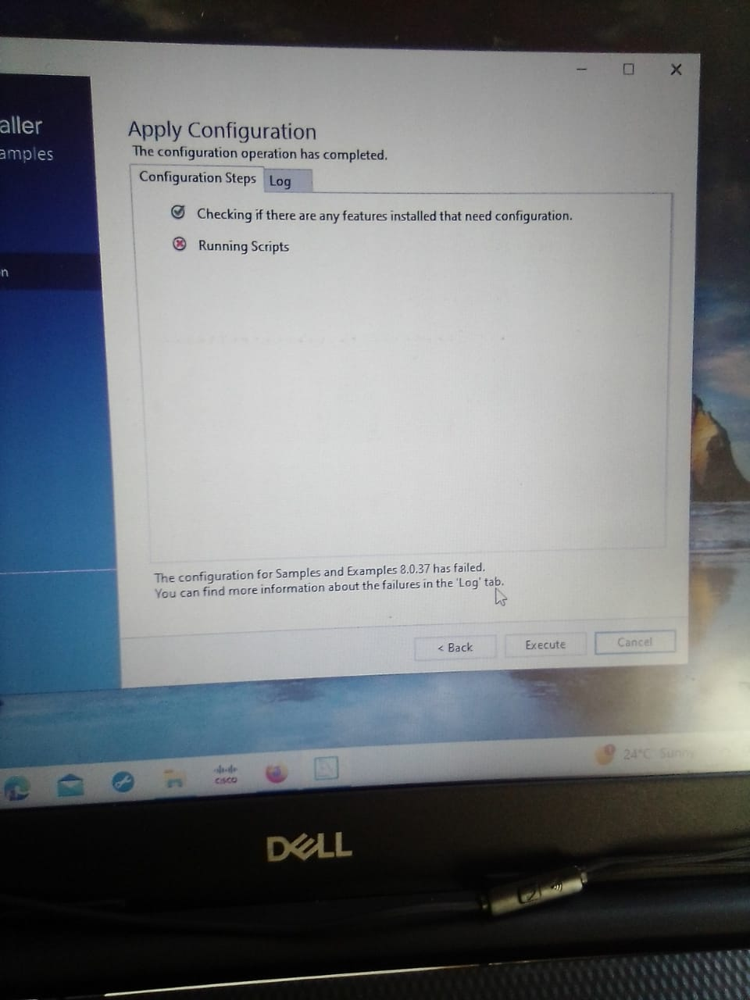
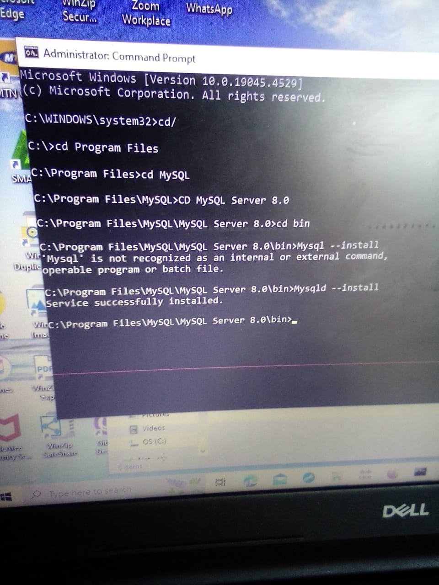

# Dev_Setup
Setup Development Environment

#Assignment: Setting Up Your Developer Environment

#Objective:
This assignment aims to familiarize you with the tools and configurations necessary to set up an efficient developer environment for software engineering projects. Completing this assignment will give you the skills required to set up a robust and productive workspace conducive to coding, debugging, version control, and collaboration.

#Tasks:

1. Select Your Operating System (OS):
   Choose an operating system that best suits your preferences and project requirements. Download and Install Windows 11. https://www.microsoft.com/software-download/windows11

   1.	How to install windows 11 
•	To install windows11 one needs to download windows from chrome using the URL https://www.misicrosoft.com/sofware-downaloads/windows10, after the download is done. 
•	Then choose what you want to do i.e. you want to upgrade PC now or create installations media for another PC.
•	Select the correct windows edition compatible to your device i.e. home or pro; then select preferred language and architecture (32 bit or 64-bit versions.)
•	Restart your device with the USB flash drive or CD inserted and boot from that device, then select “install now” once the windows installer starts. 
•	On activation the use the product key valid for windows 10, 8,7 for a first time, installation, but if you have installed windows 10 before in your device click ‘I don’t have product key’, and windows will activate once it’s installed.
•	Create a partition by selecting a custom option to ensure that you are performing a clean install and not an upgrade install. You can partition your drive whichever way you desire if you have only one drive on windows you can tell the installer to overwrite it.
•	After a fresh install of Windows 10 is completed, it should activate itself  after connecting to the internet, to ensure that the activation occurred  correctly open the start menu and click the settings; click the Update & Security button and go to the “Activation” tab. 

; 

2. Install a Text Editor or Integrated Development Environment (IDE):
   Select and install a text editor or IDE suitable for your programming languages and workflow. Download and Install Visual Studio Code. https://code.visualstudio.com/Download

Download & Install Text Editor Visual Studio Code:
•	From the official website https://code.visualstudio.com/ 
•	Click on the ‘Download’ button for windows. This should start the download of the latest installer immediately.
•	Once the download is complete, locate the downloaded file, normally under Downloads.  unless located elsewhere by the downloader and the file name will look something like this ‘VSCodeSetup-x64-1.x.x.exe’.
•	Double-click the installer and run it. There ,might be user account prompts asking for permission to make changes to your device. Click ‘Yes’ to continue. 
•	Accept the licence agreement: read through the agreement, check the box ‘I accept the agreement’. Click ‘Next’.
•	Select the installation location, by default VS Code will be installed in ‘C:\Program Files\Microsoft VS Code’. However, the installation can be in another location, click ‘browse’ and choose the preferred location. Click ‘Next’. 
•	Check the Box for ‘create a desktop icon’ if you want a shortcut on your desktop. Click Next. 
•	Once the installation is complete, it will appear on the screen and check the box launch visual studio code, click ‘Finish’. 
•	Initial Setup, you can skip the welcome section and go through the setup to configure  settings like theme, keybindings and extensions.  
•	Install Extensions: To extend the functionality of VS code, click on the Extensions icon extensions icon on the sidebar, Search for the extensions you need (e.g., Python, C++, Git, etc.) and click ‘install’. 

3. Set Up Version Control System:
   Install Git and configure it on your local machine. Create a GitHub account for hosting your repositories. Initialize a Git repository for your project and make your first commit. https://github.com

•	Open the web browser go to the Git official website.
•	Click to ‘Download’ the latest version of Git.
•	Run the installer once the download is complete, double click on the installer to run it, there might be a prompter asking for permissions to make changes in your device click ‘Yes’ to allow this.   
•	Select the destination folder should you wish to install in a different location click browse and select the desired folder (e.g. Desktop,; C:/ etc.) and click ‘Next’.
•	Select components such as Git Bash, Git CMD, Git LFS 
•	Select the start menu folder created  ‘Git’ and click Next.
•	Chose a default editor to be used by git bash (e.g. VS code, Notepad+++ etc) and Click ‘Next’.
•	Adjust your path Environment by selecting Git folder on the drive where Git is stored and open the folder and open the ‘Bin’ folder and double click the tab and copy the path. Open the command prompt and open the environmental variables, chose user path, and select ‘New’ path and click ‘OK’ once path is created click ‘OK’ to exit the Command Prompt (CMD).
•	Open ‘Git Bash’ and check version by writing ‘git - -version’.
•	To add an assignment on GitHub, you browse to the LMS and press on ‘click here’.
•	A GitHub classroom will open then ‘click’ on the Assignment to open on GitHub.
•	On GitHub ‘fork’ the assignment
•	Go inside the repository on ‘GitHub’ and click on the ‘code’ and copy it. 
•	Open ‘GitBash’ to clone your assignment  to cd Desktop or D:/ etc. 
•	Then proceed with Git clone  and paste code you copied from GitHub.
•	Thereafter, create a folder with the assignment name by prompting cd assignment folder name.
•	Then open through VS Code by prompting git bash to Code .
•	After completing the assignment on VS code open a new terminal and open the +command git bash
•	Then prompt call on git Add. (to add the assignment answers); then git commit “answer to assignment”; git push.
•	Revert to GitHub to the new commit. Then  click on the answers README link and open the copy the code and got to the LMS and click on submit assignment paste the assignment link and submit.

4. Install Necessary Programming Languages and Runtimes:
  Instal Python from http://wwww.python.org programming language required for your project and install their respective compilers, interpreters, or runtimes. Ensure you have the necessary tools to build and execute your code.

•	Open the Web browser and go to the official python website. 
•	Click in the Downloads in the navigation bar. Click on the ‘Download Python XXX’ latest version for windows. 
•	Run the installer: Locate the file and double click to run it. The user account control prompt may ask for permission, click ‘Yes’ to continue.
•	Setup python installation : At the bottom of the installer window, check the box ‘Add Python XX to PATH’ This will allow you to use Python from the command line click on the ‘customise installation’ button.
•	 Optional features :pip, python test suite, py.launcher, Documentation etc. 
•	Advanced options: Ensure the following options are checked; ‘install for all users’ ; ‘create shortcuts for installed applications’; ‘add python to environment path’; ‘precompile standard library’, click ‘Install’. 
•	Wait for installation to be completed and once done click ‘Done’. To exit the installer. 

; ; 

5. Install Package Managers:
   If applicable, install package managers like pip (Python).

•	Check if 'pip' is already installed during the installation process, to do this type command prompt on the search bar menu on the start button.
•	Open the command Prompt and type 'pip --Version' and press Enter. 
•	if 'pip' is installed, the version number will appear. 
•	If 'pip' is not installed, the download ‘get-pip.py’ from https://bootstrap.pypa.io/get-pip.py.
•	Open the command line  and navigate the directory where you downloaded ‘get-pip.py’
•	Run the following command “python get-pip.py”
•	This will install ‘pip’ globally on your system. 
•	Verify  ‘pip’ installation by typing ‘pip --Version’ ; pip should be installed correctly now. 

6. Configure a Database (MySQL):
   Download and install MySQL database. https://dev.mysql.com/downloads/windows/installer/5.7.html

•	Open web browser and go to the MySQL official Website. 
•	Click on the ‘Download’ button for the MySQL installer for Windows. 
•	You will be redirected to a web page where you can choose between two versions: Web Installer; Full, preferable to download the full version.
•	Select version you want to download, and you will be asked to sign up for an oracle of account click ‘No thanks, just start my download’. 
•	Run the installer by double clicking it and the command user prompt will ask for permissions click ‘Yes’.
•	You will be presented with several setup types ‘Developer default’, ‘Server only’, ‘client only’, ‘Full’ or ‘Custom’. 
•	Select ‘Developer default’ as it installs MySQL server, MySQL workbench and other user tools. Then click ‘Next’. 
•	Check the missing requirements, should anything be missing click ‘Execute’ to install the necessary components. Once the requirements are met click ‘Next’.
•	A list of products should appear, click ‘Execute’ to begin installation, may take some minutes, but once installation is done click ‘Next’. 
•	For configuration: choose ‘standalone MySQL server’ option and Click ‘Next’.
•	Authentication method: select use ‘Strong password Encryption for Authentication’ and Click ‘Next’.
•	Set roots password (Ensure to write the password down somewhere as it is the administrative account for MySQL server) and click ‘Next’. 
•	For windows service : Ensure that ‘configure MySQL server as a windows service’ is checked.
•	Set the windows ‘MySQL service name’ to ‘MySQL80’ or keep the default and click ‘Next’. 
•	Appy configuration: Click ‘Execute’ to apply configuration settings.
•	Once configuration is complete click ‘Finish’
•	Complete the installation: The installer may ask you to configure other MySQL products (like MySQL Router or Samples and Examples). You can configure them as needed or skip if you don’t need them. Click ‘Next’ and then ‘Finish’ to complete the installation.
•	Verify the installation:  In MySQL Workbench, click on the ‘Local instance MySQL80’(or whatever name you gave to your server instance). Enter the root password you set during the installation. Click ‘OK’.
•	Verify connection: You should now be connected to the MySQL server and can start executing SQL queries.

  ; ; 

7. Set Up Development Environments and Virtualization (Optional):
   Consider using virtualization tools like Docker or virtual machines to isolate project dependencies and ensure consistent environments across different machines.

8. Explore Extensions and Plugins:
   Explore available extensions, plugins, and add-ons for your chosen text editor or IDE to enhance functionality, such as syntax highlighting, linting, code formatting, and version control integration.

To add extensions on VS code you navigate to the extensions panel and search the extension such as syntax highlighting, linting and code formatting . 
Find the extension you want in the search results,
Click on the verified extension from the results. 
Then click on install and the extension will be installed. 
After installation you can manage your installed extensions, either to disable or uninstall. 
 

9. Document Your Setup:
    Create a comprehensive document outlining the steps you've taken to set up your developer environment. Include any configurations, customizations, or troubleshooting steps encountered during the process. 

If you encounter any problem with an installation tools like ChatGPT, Youtube, W3schools were helpful in fixing any issues. Uninstalling tools was also recommended in cases where several troubleshooting had been attempted and a fresh install was initiated. 

#Deliverables:
- Document detailing the setup process with step-by-step instructions and screenshots where necessary.
- A GitHub repository containing a sample project initialized with Git and any necessary configuration files (e.g., .gitignore).
- A reflection on the challenges faced during setup and strategies employed to overcome them.

#Submission:
Submit your document and GitHub repository link through the designated platform or email to the instructor by the specified deadline.

#Evaluation Criteria:**
- Completeness and accuracy of setup documentation.
- Effectiveness of version control implementation.
- Appropriateness of tools selected for the project requirements.
- Clarity of reflection on challenges and solutions encountered.
- Adherence to submission guidelines and deadlines.

Note: Feel free to reach out for clarification or assistance with any aspect of the assignment.
